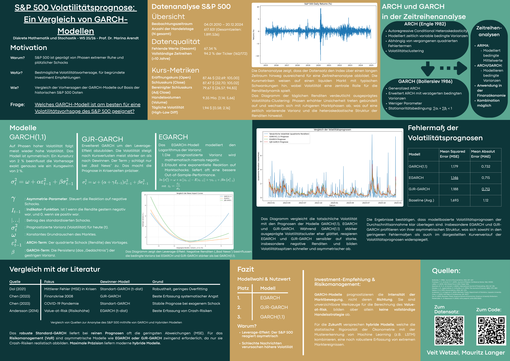

# S&P 500 Volatilitätsprognose: Ein Vergleich von GARCH-Modellen

[](https://www.python.org/downloads/)
[](LICENSE)



## 📋 Projektübersicht

Dieses Projekt untersucht die Volatilitätsdynamiken des S&P 500 Index mittels verschiedener GARCH-Modelle (Generalized Autoregressive Conditional Heteroskedasticity). Die zentrale Forschungsfrage lautet:

> **"Welches GARCH-Modell ist am besten für eine Volatilitätsprognose des S&P 500 geeignet?"**

### Untersuchte Modelle

- **GARCH(1,1)** - Standard-GARCH-Modell (Bollerslev 1986)
- **EGARCH** - Exponential GARCH (erfasst Leverage-Effekt)
- **GJR-GARCH** - Glosten-Jagannathan-Runkle GARCH (asymmetrische Volatilität)

## 🎯 Haupterkenntnisse

Das Projekt vergleicht die Modelle anhand von:
- **Mean Squared Error (MSE)** - Durchschnittliche quadratische Abweichung
- **Mean Absolute Error (MAE)** - Durchschnittliche absolute Abweichung
- Out-of-Sample Prognosegenauigkeit
- Leverage-Effekt-Analyse

**Ergebnis:** Das robuste Standard-GARCH liefert bei reinen Prognosen oft die geringsten Abweichungen (MSE), während EGARCH und GJR-GARCH zwingend erforderlich sind, um Crash-Risiken zu modellieren.

## 📊 Datensatz

- **Quelle:** S&P 500 Index- und Einzelaktiendaten
- **Zeitraum:** 04.01.2010 - 20.12.2024 (ca. 15 Jahre)
- **Beobachtungen:** 617.631 Datenpunkte
- **Fehlende Werte:** 67,34% (typisch für Aktiendaten aufgrund unterschiedlicher Handelstage)

### Datenqualität

| Metrik | Wert |
|--------|------|
| Eröffnungskurs (Open) | $87,46 [$32,69; $105,00] |
| Schlusskurs (Close) | $87,49 [$32,90; $105,20] |
| Bereinigte Schlusskurse | $79,87 [$26,57; $94,83] |
| Handelsvolumen | 9,35 Mio. [1,14; 5,64] |
| Tägliche Volatilität | 1,43 $: 0,32% (High-Low Diff) |

## 🏗️ Projektstruktur

```
DMS/
├── README.md                          # Diese Datei
├── requirements.txt                   # Python-Abhängigkeiten
├── .gitignore                        # Git-Ausschlüsse
├── DMS.bib                           # Literaturverzeichnis (BibTeX)
├── docs/
│   └── poster_dse2024.png           # Wissenschaftliches Poster
├── data/
│   ├── sp500_index.csv              # S&P 500 Index-Daten
│   └── sp500_stocks.csv             # Einzelaktiendaten
├── notebooks/
│   └── garch_analysis_index_erweitert.ipynb  # Hauptanalyse
```

## 🚀 Schnellstart

### Voraussetzungen

- Python 3.11+
- pip (Python Package Installer)
- Jupyter Notebook oder JupyterLab

### Installation

1. **Repository klonen oder herunterladen**
   ```bash
   cd /Users/mauritzlanger/Programmierung/DMS
   ```

2. **Virtuelle Umgebung erstellen (empfohlen)**
   ```bash
   python3 -m venv venv
   source venv/bin/activate  # macOS/Linux
   ```

3. **Abhängigkeiten installieren**
   ```bash
   pip install -r requirements.txt
   ```

4. **Jupyter Notebook starten**
   ```bash
   jupyter notebook notebooks/garch_analysis_index_erweitert.ipynb
   ```

### Alternative: Direkte Installation der Pakete

```bash
pip install pandas numpy matplotlib seaborn arch statsmodels scikit-learn scipy jupyter
```

## 📖 Verwendung

### Notebook-Struktur

Das Hauptnotebook `garch_analysis_index_erweitert.ipynb` ist in folgende Abschnitte unterteilt:

1. **Deskriptive Analyse** - Datenqualität und Übersicht
2. **Renditeberechnung** - Logarithmische Renditen
3. **Stationaritätstest** - ADF-Test (Augmented Dickey-Fuller)
4. **GARCH-Modellierung** - Schätzung von GARCH(1,1), EGARCH, GJR-GARCH
5. **Out-of-Sample Prognose** - Rolling Forecast
6. **Modellevaluation** - MSE/MAE-Vergleich
7. **Leverage-Effekt** - Visualisierung negativer Schocks
8. **Konfidenzintervalle** - Unsicherheitsbereiche der Prognosen
9. **Fazit** - Zusammenfassung und Investment-Empfehlungen

### Wichtige Codeabschnitte

**Renditen berechnen:**
```python
returns = 100 * np.log(data['Close'] / data['Close'].shift(1))
```

**GARCH(1,1) Modell schätzen:**
```python
from arch import arch_model
model = arch_model(returns, vol='Garch', p=1, q=1)
fitted = model.fit(disp='off')
```

**Out-of-Sample Prognose:**
```python
forecast = fitted.forecast(horizon=1)
predicted_variance = forecast.variance.iloc[-1, 0]
```

## 📈 Ergebnisse

### Modellvergleich (MSE & MAE)

| Modell | Mean Squared Error (MSE) | Mean Absolute Error (MAE) |
|--------|--------------------------|---------------------------|
| **EGARCH** | 1,146 | **0,715** |
| **GJR-GARCH** | 1,188 | 0,713 |
| **GARCH(1,1)** | **1,179** | **0,732** |
| Baseline (Avg.) | 1,693 | 1,12 |

### Investment-Empfehlung & Risikomanagement

✅ **GARCH-basierte Volatilitätsprognosen** erfassen die Intensität der Marktbewegung, **nicht** deren Richtung. Sie sind zwingend erforderlich für:

- **Value-at-Risk (VaR)** berechnen
- **Portfoliogewichtung** anpassen (weniger Investition bei höherer Volatilität)
- **Optionspreise** bewerten (Black-Scholes)

⚠️ **Hybride Modelle** (z.B. ARIMA-GARCH, LSTM) versprechen für die Zukunft eine bessere Kombination aus Volatilitäts- und Kursvorhersage.

## 📚 Literatur

Siehe `DMS.bib` für vollständige Referenzen. Wichtigste Quellen:

- **Bollerslev (1986)** - Generalized Autoregressive Conditional Heteroskedasticity
- **Chen (2023)** - COVID-19 Pandemie Volatilität
- **Dal (2021)** - Mittlere Fehler in Krisenzeiten
- **Mustapa & Ismail (2019)** - Hybrid ARIMA-GARCH für S&P 500

## 🎓 Kontext

**Kurs:** Diskrete Mathematik und Stochastik - WS 25/26  
**Dozent:** Prof. Dr. Marina Arendt  
**Autor:** Veit Wetzel, Mauritz Langer  
**Veranstaltung:** DSE 2024 Poster Präsentation

## 📄 Lizenz

Dieses Projekt ist lizenziert unter der MIT-Lizenz - siehe [LICENSE](LICENSE) Datei für Details.

## 🤝 Beitrag

Feedback und Verbesserungsvorschläge sind willkommen! Für größere Änderungen öffnen Sie bitte zuerst ein Issue.

## 📧 Kontakt

Bei Fragen wenden Sie sich bitte an:
- Mauritz Langer
- Veit Wetzel

---

**Hinweis:** Dieses Projekt dient ausschließlich akademischen und edukativen Zwecken. Es stellt keine Anlageberatung dar.
